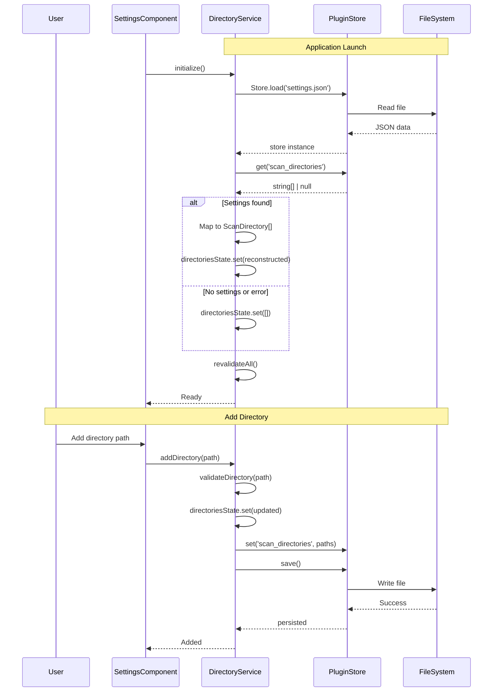
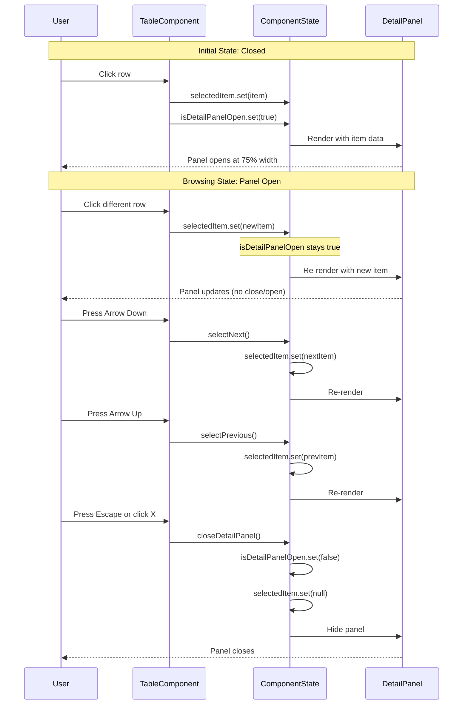

# API Contract: Settings and Detail View

**Feature**: [spec.md](../spec.md) | **Date**: 2025-01-19 | **Phase**: 1 (Design) | **Version**: 1.0

## Overview

This document defines the internal API contracts for settings persistence and detail view functionality. Note that no new public Tauri commands are needed - all functionality is implemented on the frontend using existing Tauri plugin-store.

---

## Tauri Commands (Existing - No Changes Needed)

### validate_directory

**Purpose**: Validate a scan directory path

**Signature**:
```rust
#[tauri::command]
async fn validate_directory(path: String) -> Result<ValidationResult, String>
```

**Request**:
```typescript
interface ValidateDirectoryRequest {
    path: string;  // Directory path to validate
}
```

**Response**:
```typescript
interface ValidationResult {
    valid: boolean;
    errorCode?: 'path_not_found' | 'not_a_directory' | 'access_denied' | 'missing_media_subdirectory' | 'duplicate_directory';
    message?: string;
    details?: string;
}
```

**Usage**:
```typescript
// Already implemented in directory.service.ts
const result = await invoke<ValidationResult>('validate_directory', { path });
```

---

## Frontend Service APIs

### DirectoryService

**Location**: `src/app/features/settings/services/directory.service.ts`

**Modifications Needed**:

#### 1. initialize() - Load persisted directories on startup (FR-001)

```typescript
async initialize(): Promise<void> {
    // NEW: Load from plugin-store first
    await this.loadDirectories();

    // Existing: Revalidate all directories
    this.revalidateAll();
}
```

**Precondition**: None
**Postcondition**: `directoriesState` signal contains reconstructed `ScanDirectory[]` from persisted paths

#### 2. addDirectory() - Persist after adding (FR-002)

```typescript
async addDirectory(path: string): Promise<void> {
    // ... existing validation ...

    const updated = [...this.directoriesState(), newDirectory];
    this.directoriesState.set(updated);

    // NEW: Persist to plugin-store
    await this.saveScanDirs(updated);
}
```

**Precondition**: Path validation succeeded
**Postcondition**: New directory persisted to `settings.json`

#### 3. removeDirectory() - Already persists (FR-003)

No changes needed - already calls `saveScanDirs()`.

#### 4. loadDirectories() - Load from plugin-store with error handling (FR-004)

```typescript
async loadDirectories(): Promise<void> {
    try {
        if (!this.store) {
            this.store = await Store.load('settings.json');
        }
        const dirs = await this.store.get<string[]>(SCAN_DIRECTORIES_KEY);

        if (dirs) {
            const scanDirs: ScanDirectory[] = dirs.map((path) => ({
                id: this.generateId(),
                path,
                status: 'pending',
                displayName: this.extractDisplayName(path),
                addedAt: Date.now(),
                lastScannedAt: 0,
                itemCount: 0,
                weaponCount: 0,
            }));
            this.directoriesState.set(scanDirs);
        } else {
            this.directoriesState.set(DEFAULT_SCAN_DIRECTORIES);
        }
    } catch (error) {
        console.error('Failed to load scan directories:', error);
        this.directoriesState.set(DEFAULT_SCAN_DIRECTORIES);
    }
}
```

**Precondition**: None
**Postcondition**: `directoriesState` contains valid array (empty on error)
**Error Handling**: Falls back to empty array on corrupted settings

---

## Component APIs

### WeaponsComponent

**Location**: `src/app/features/data/weapons/weapons.component.ts`

#### New Signals (FR-005)

```typescript
readonly selectedWeapon = signal<Weapon | null>(null);
readonly isDetailPanelOpen = signal<boolean>(false);
readonly detailPanelPosition = signal<'normal' | 'overlay'>('normal');
```

#### New Methods (FR-006)

```typescript
/**
 * Select a weapon and display in detail panel
 * @param weapon - Weapon entity to display
 */
selectWeapon(weapon: Weapon): void {
    this.selectedWeapon.set(weapon);
    this.isDetailPanelOpen.set(true);
}

/**
 * Close the detail panel and clear selection
 */
closeDetailPanel(): void {
    this.isDetailPanelOpen.set(false);
    this.selectedWeapon.set(null);
}

/**
 * Select the next weapon in the list (keyboard navigation)
 * Precondition: A weapon must be selected
 */
selectNext(): void {
    const current = this.selectedWeapon();
    if (!current) return;

    const weapons = this.paginatedWeapons();
    const index = weapons.findIndex(w => w.key === current.key);
    if (index < weapons.length - 1) {
        this.selectWeapon(weapons[index + 1]);
    }
}

/**
 * Select the previous weapon in the list (keyboard navigation)
 * Precondition: A weapon must be selected
 */
selectPrevious(): void {
    const current = this.selectedWeapon();
    if (!current) return;

    const weapons = this.paginatedWeapons();
    const index = weapons.findIndex(w => w.key === current.key);
    if (index > 0) {
        this.selectWeapon(weapons[index - 1]);
    }
}
```

---

### ItemsComponent

**Location**: `src/app/features/data/items/items.component.ts`

#### New Signals (FR-005)

```typescript
readonly selectedItem = signal<Item | null>(null);
readonly isDetailPanelOpen = signal<boolean>(false);
readonly detailPanelPosition = signal<'normal' | 'overlay'>('normal');
```

#### New Methods (FR-006)

Same method signatures as WeaponsComponent, but for `Item` type instead of `Weapon`.

---

## Tauri Plugin-Store API

### Store.load()

**Purpose**: Load existing store or create new one

**Signature**:
```typescript
const store = await Store.load(path: string): Promise<Store>
```

**Parameters**:
- `path`: Relative path to store file (e.g., `'settings.json'`)

**Returns**: `Store` instance

**Error Handling**: Throws if file system is inaccessible

**Example**:
```typescript
const store = await Store.load('settings.json');
```

---

### Store.get()

**Purpose**: Retrieve value from store

**Signature**:
```typescript
const value = await store.get<T>(key: string): Promise<T | null>
```

**Parameters**:
- `key`: Store key (e.g., `'scan_directories'`)

**Returns**: `T | null` (Value or null if not found)

**Type Parameter**: `T` - Expected type of stored value

**Example**:
```typescript
const paths = await store.get<string[]>('scan_directories');
// Returns: string[] | null
```

---

### Store.set()

**Purpose**: Set value in store (in-memory only, not persisted)

**Signature**:
```typescript
await store.set(key: string, value: any): Promise<void>
```

**Parameters**:
- `key`: Store key
- `value`: Value to store (must be JSON-serializable)

**Note**: Changes are not persisted until `save()` is called

**Example**:
```typescript
await store.set('scan_directories', ['/path/to/media', '/another/path']);
```

---

### Store.save()

**Purpose**: Persist store to disk

**Signature**:
```typescript
await store.save(): Promise<void>
```

**Error Handling**: Throws if write fails (permissions, disk full, etc.)

**Example**:
```typescript
await store.set('scan_directories', paths);
await store.save();  // Write to disk
```

---

## Translation Keys API

### New Key: hotkeys.game_path (FR-010/FR-011)

**Purpose**: Label for game path input in hotkeys component

**Files**:
- `src/assets/i18n/en.json`
- `src/assets/i18n/zh.json`

**Key Path**: `hotkeys.game_path`

**Values**:
- English: `"Game Path"`
- Chinese: `"游戏路径"`

**Usage in Template**:
```html
<label>{{ 'hotkeys.game_path' | transloco }}</label>
```

---

## Event Flow Diagrams

### Settings Persistence Flow



### Detail View Interaction Flow



---

## CSS Styling Contracts

### Detail Panel Styles (FR-012/FR-013/FR-014)

**Location**: `src/app/features/data/weapons/weapons.component.scss` and `items.component.scss`

```scss
.detail-panel {
    // FR-012: Panel dimensions
    width: 75%;
    min-width: 400px;

    // FR-013: Solid background (not transparent)
    background: oklch(var(--b2));

    // FR-014: Theme-aware colors for automatic switching
    border-left: 1px solid oklch(var(--b3));

    // Other styles
    position: fixed;
    top: 0;
    right: 0;
    height: 100vh;
    box-shadow: -4px 0 12px rgba(0, 0, 0, 0.1);
    z-index: 50;
    display: flex;
    flex-direction: column;

    &.overlay {
        width: 100%;
        max-width: 60%;
        background: oklch(var(--b2));
        border-left: none;
    }
}
```

**Contract Requirements**:
- Panel width: 75% of viewport with minimum 400px
- Background: Solid `oklch(var(--b2))` for theme support
- Border: `oklch(var(--b3))` for subtle contrast
- Must update automatically when DaisyUI theme changes

---

## Error Contracts

### Settings Load Error Handling

**Error Condition**: Corrupted or missing `settings.json`

**Contract**:
```typescript
try {
    await this.loadDirectories();
} catch (error) {
    console.error('Failed to load scan directories:', error);
    // Graceful fallback - MUST NOT crash application
    this.directoriesState.set(DEFAULT_SCAN_DIRECTORIES);
}
```

**Requirements**:
- Application MUST NOT crash on corrupted settings
- MUST fall back to empty directory array
- MUST log error to console for debugging
- User MUST be able to reconfigure directories manually

---

## Summary

**No New Tauri Commands**: All functionality uses existing plugin-store

**Frontend Changes Only**:
- `DirectoryService`: Wire up persistence methods
- `WeaponsComponent`/`ItemsComponent`: Add detail panel state and navigation
- i18n files: Add `hotkeys.game_path` key
- SCSS files: Add side panel styles

**API Stability**: No breaking changes to existing APIs
