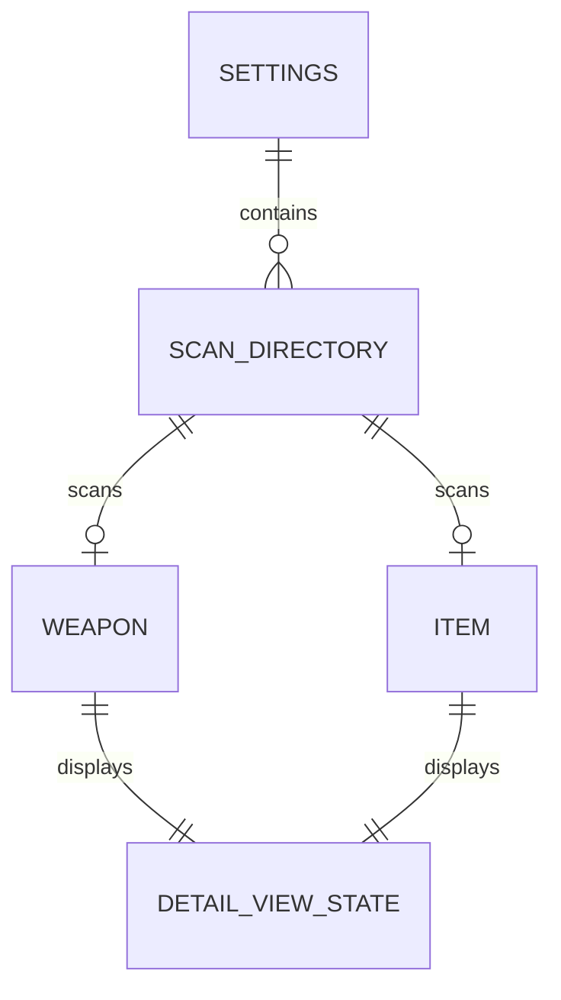
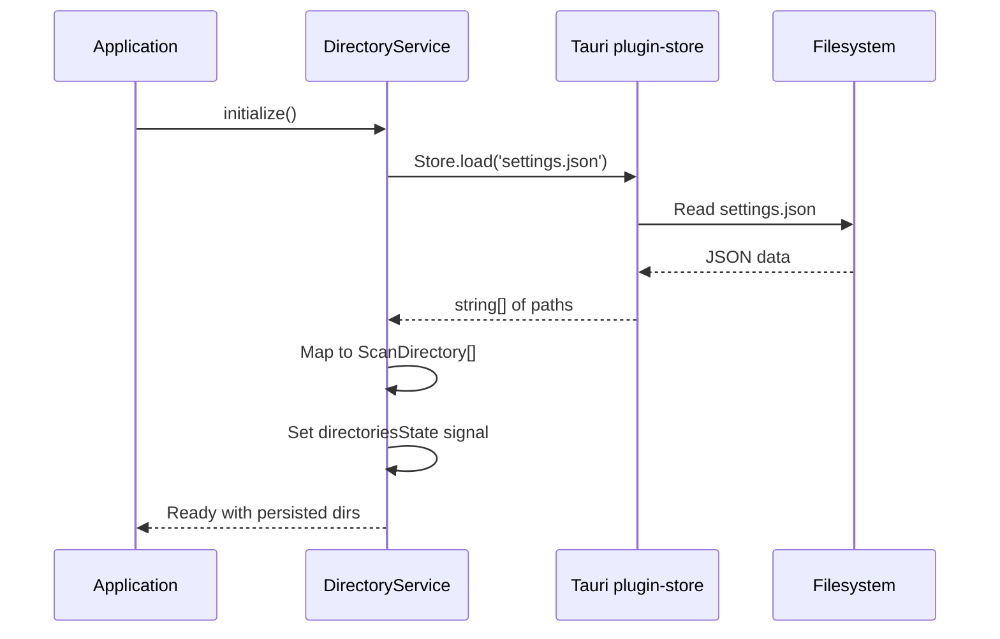
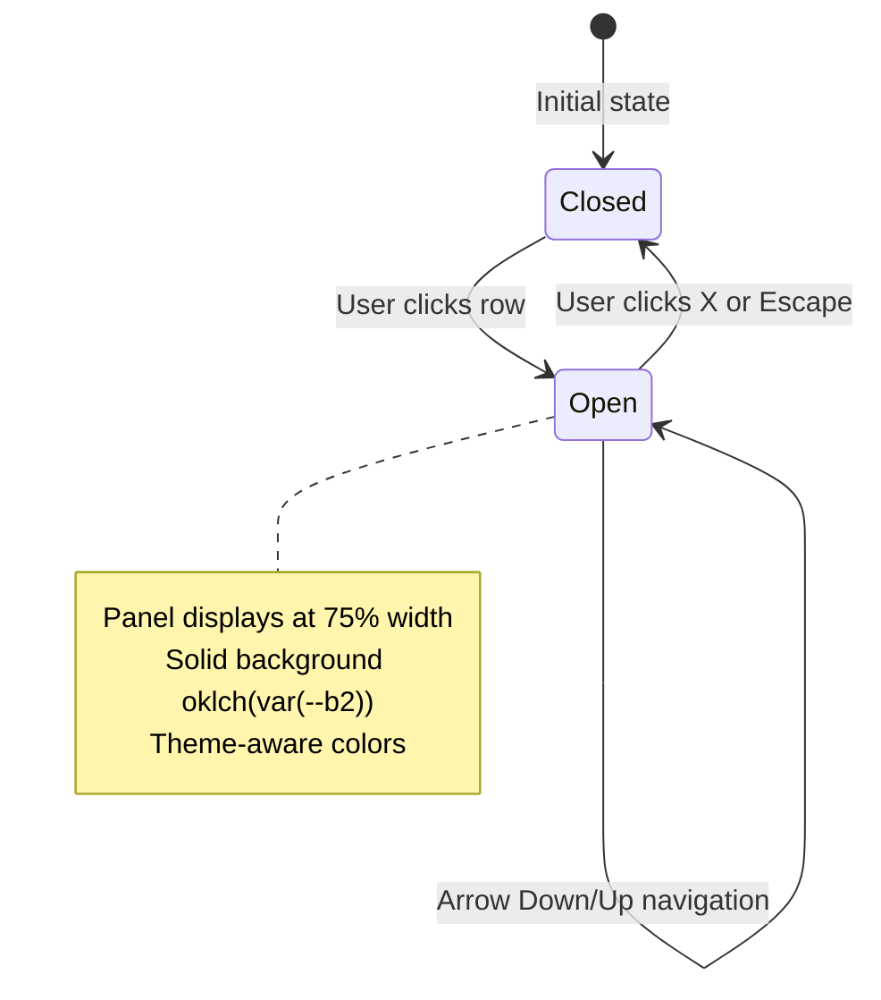

# Data Model: Settings Persistence and Detail View UX

**Feature**: [spec.md](./spec.md) | **Date**: 2025-01-19 | **Phase**: 1 (Design)

## Overview

This document describes the data structures and state management for settings persistence and detail view functionality. Feature 007 introduces no new data models but defines state management patterns for the non-modal detail view and clarifies persistence behavior.

---

## Entity Relationships



---

## Key Entities

### 1. Settings Store

**Purpose**: Persist scan directory configurations across application sessions

**Storage**: Tauri plugin-store (`settings.json`)

**Schema**:
```typescript
interface SettingsStore {
    scan_directories?: string[];  // Array of directory paths (NOT full ScanDirectory objects)
    selectedDirectoryId?: string;  // ID of currently selected directory
}
```

**Notes**:
- Only directory paths are persisted (as `string[]`)
- Full `ScanDirectory` objects with metadata (status, counts, etc.) are reconstructed on load
- This approach keeps persisted data minimal and avoids stale metadata
- File location: Platform-specific app data directory (handled by Tauri plugin-store)

---

### 2. ScanDirectory

**Purpose**: Represents a configured scan directory with runtime state

**Location**: `src/app/shared/models/directory.models.ts` (already exists)

**Schema**:
```typescript
interface ScanDirectory {
    id: string;                    // Unique identifier (generated)
    path: string;                  // Filesystem path
    status: DirectoryStatus;       // 'pending' | 'valid' | 'invalid'
    displayName: string;           // Extracted from path (folder name)
    addedAt: number;               // Timestamp when added
    lastScannedAt: number;         // Timestamp of last successful scan
    itemCount: number;             // Number of items found
    weaponCount: number;           // Number of weapons found
    lastError?: {                  // Validation/scan error details
        errorCode: DirectoryErrorCode;
        message: string;
    };
}
```

**State Transitions**:
```
pending → valid (after successful validation)
pending → invalid (after failed validation)
valid → invalid (after failed revalidation)
invalid → valid (after successful revalidation)
```

**Persistence**:
- Path only: Saved to `settings.json` under `scan_directories` key
- Full object: Reconstructed on load with `status: 'pending'` and counts reset to 0

---

### 3. Detail View State

**Purpose**: Manages the visibility and content of non-modal detail panel

**Schema**:
```typescript
interface DetailViewState<T> {
    selectedItem: T | null;        // Currently selected weapon/item
    isOpen: boolean;               // Whether detail panel is visible
    position: 'normal' | 'overlay';  // Layout mode based on screen size
}
```

**Layout Modes**:
- `normal` (desktop >1024px): 75% width side panel on right, min-width 400px
- `overlay` (smaller screens): Full-width or slide-over panel

**Per FR-012/FR-013/FR-014 Clarifications**:
- Panel width: 75% of viewport with minimum 400px
- Panel background: Solid color using `oklch(var(--b2))`
- Theme support: Automatic adaptation via DaisyUI CSS variables

---

### 4. Weapon Model

**Purpose**: Represents a scanned weapon entity from RWR game data

**Location**: `src/app/shared/models/weapons.models.ts` (already exists)

**Key Properties**:
```typescript
interface Weapon {
    key: string;                   // Unique identifier (e.g., "rifle_assault_m4_carry_item")
    name: string;                  // Display name from XML
    category?: string;             // Weapon category
    filePath: string;              // Full path to source XML file
    // ... other properties
}
```

---

### 5. Item Model

**Purpose**: Represents a scanned item entity from RWR game data

**Location**: `src/app/shared/models/items.models.ts` (already exists)

**Key Properties**:
```typescript
interface Item {
    key: string;                   // Unique identifier
    name: string;                  // Display name from XML
    filePath: string;              // Full path to source XML file
    // ... other properties
}
```

---

## State Management

### Component-Level Signals

**Weapons Component** (`weapons.component.ts`):
```typescript
class WeaponsComponent {
    // Existing signals
    readonly weapons = signal<Weapon[]>([]);
    readonly loading = signal(false);

    // NEW: Detail view state (FR-005)
    readonly selectedWeapon = signal<Weapon | null>(null);
    readonly isDetailPanelOpen = signal<boolean>(false);
    readonly detailPanelPosition = signal<'normal' | 'overlay'>('normal');

    // NEW: Navigation methods (FR-006)
    selectWeapon(weapon: Weapon): void {
        this.selectedWeapon.set(weapon);
        this.isDetailPanelOpen.set(true);
    }

    closeDetailPanel(): void {
        this.isDetailPanelOpen.set(false);
        this.selectedWeapon.set(null);
    }

    selectNext(): void { /* ... */ }
    selectPrevious(): void { /* ... */ }
}
```

**Items Component** (`items.component.ts`):
```typescript
class ItemsComponent {
    // Existing signals
    readonly items = signal<Item[]>([]);
    readonly loading = signal(false);

    // NEW: Detail view state (FR-005)
    readonly selectedItem = signal<Item | null>(null);
    readonly isDetailPanelOpen = signal<boolean>(false);
    readonly detailPanelPosition = signal<'normal' | 'overlay'>('normal');

    // NEW: Navigation methods (FR-006)
    selectItem(item: Item): void {
        this.selectedItem.set(item);
        this.isDetailPanelOpen.set(true);
    }

    closeDetailPanel(): void {
        this.isDetailPanelOpen.set(false);
        this.selectedItem.set(null);
    }

    selectNext(): void { /* ... */ }
    selectPrevious(): void { /* ... */ }
}
```

### Service-Level Signals

**Directory Service** (`directory.service.ts` - modifications):
```typescript
class DirectoryService {
    // Existing signals
    readonly directoriesSig = readonly signal<ScanDirectory[]>([]);

    // MODIFY: initialize() to use plugin-store (FR-001)
    async initialize(): Promise<void> {
        // Load from plugin-store first
        await this.loadDirectories();  // <-- ADD THIS

        // Revalidate all directories to update status
        this.revalidateAll();
    }

    // MODIFY: addDirectory() to persist (FR-002)
    async addDirectory(path: string): Promise<void> {
        // ... existing validation code ...

        // Update state
        const updated = [...this.directoriesState(), newDirectory];
        this.directoriesState.set(updated);

        // Persist to plugin-store  <-- ADD THIS
        await this.saveScanDirs(updated);
    }

    // KEEP: removeDirectory() already persists (FR-003)
    async removeDirectory(directoryId: string): Promise<void> {
        const updated = this.directoriesState().filter(
            (d) => d.id !== directoryId,
        );
        this.directoriesState.set(updated);
        await this.saveScanDirs(updated);  // <-- KEEP THIS (already exists)
    }

    // MODIFY: Add error handling for corrupted settings (FR-004)
    async loadDirectories(): Promise<void> {
        try {
            if (!this.store) {
                this.store = await Store.load('settings.json');
            }
            const dirs = await this.store.get<string[]>(SCAN_DIRECTORIES_KEY);
            // ... reconstruct ScanDirectory objects ...
        } catch (error) {
            console.error('Failed to load scan directories:', error);
            // Graceful fallback - use empty array
            this.directoriesState.set(DEFAULT_SCAN_DIRECTORIES);
        }
    }
}
```

---

## Validation Rules

### Scan Directory Path Validation

**Backend Tauri Command**: `validate_directory`

**Validation Rules**:
1. Path must exist on filesystem
2. Path must be a directory (not a file)
3. Path must contain a `media` subdirectory
4. Path must be readable (access permissions)

**Error Codes**:
- `path_not_found`: Path does not exist
- `not_a_directory`: Path is a file, not a directory
- `access_denied`: Insufficient read permissions
- `missing_media_subdirectory`: No `media/` folder found
- `duplicate_directory`: Path already in configuration

---

## File Path Display Strategy

### CSS Solution for Long Paths (FR-009)

**Requirement**: File paths must occupy dedicated line with word-wrap to prevent horizontal scrolling

**Location**: `src/app/features/data/weapons/weapons.component.scss` and `items.component.scss`

```scss
// Detail side panel
.detail-panel {
    position: fixed;
    top: 0;
    right: 0;
    width: 75%;        // FR-012: 3/4 width for spacious detail view
    min-width: 400px;  // FR-012: Minimum width constraint
    height: 100vh;
    background: oklch(var(--b2));  // FR-013: Solid theme-aware background
    border-left: 1px solid oklch(var(--b3));
    box-shadow: -4px 0 12px rgba(0, 0, 0, 0.1);
    z-index: 50;
    display: flex;
    flex-direction: column;

    .detail-content {
        flex: 1;
        padding: 1rem;
        overflow-y: auto;

        // File path cell with word break for long paths
        .file-path-cell {
            word-break: break-all;  // Break long paths at any character
            max-width: 100%;        // Constrain to panel width
            font-family: ui-monospace, monospace;
            font-size: 0.75rem;     // text-xs for high information density
            color: oklch(var(--bc) / 0.7);  // FR-014: Theme-aware secondary text
            line-height: 1.4;       // Readable line spacing
        }
    }
}
```

---

## Translation Keys

### New Key (FR-010/FR-011)

**Purpose**: Add missing translation for game path label in hotkeys component

**Location**:
- `src/assets/i18n/en.json`
- `src/assets/i18n/zh.json`

**Structure**:
```json
{
    "hotkeys": {
        "game_path": "Game Path"      // English
    }
}
```

```json
{
    "hotkeys": {
        "game_path": "游戏路径"        // Chinese
    }
}
```

---

## Error Handling

### Settings Persistence Errors

**Scenario**: Corrupted or missing `settings.json` (FR-004)

**Handling**:
```typescript
async loadDirectories(): Promise<void> {
    try {
        if (!this.store) {
            this.store = await Store.load('settings.json');
        }
        const dirs = await this.store.get<string[]>(SCAN_DIRECTORIES_KEY);

        if (dirs) {
            const scanDirs: ScanDirectory[] = dirs.map((path) => ({
                id: this.generateId(),
                path,
                status: 'pending',
                displayName: this.extractDisplayName(path),
                addedAt: Date.now(),
                lastScannedAt: 0,
                itemCount: 0,
                weaponCount: 0,
            }));
            this.directoriesState.set(scanDirs);
        } else {
            // No persisted settings found, use default
            this.directoriesState.set(DEFAULT_SCAN_DIRECTORIES);
        }
    } catch (error) {
        console.error('Failed to load scan directories:', error);
        // Graceful fallback - use empty array on corrupted settings
        this.directoriesState.set(DEFAULT_SCAN_DIRECTORIES);
    }
}
```

**User Experience**:
- Application does not crash
- Empty directory list displayed
- User can reconfigure directories manually
- Error logged to console for debugging

---

## Data Flow Diagrams

### Settings Persistence Flow



### Detail View Navigation Flow



---

## Constitutional Compliance

### Principle IV: Signal-Based State Management ✅

- Component state uses `signal<T>()` not `BehaviorSubject`
- Service state uses `signal<T>()` not `BehaviorSubject`
- Immutable updates via `.set()` and `.update()`

### Principle VII: Tailwind-First Styling ✅

- Panel uses custom SCSS for positioning (required for `position: fixed`)
- Content area uses Tailwind utilities (`p-4`, `overflow-y-auto`)
- Custom CSS only where Tailwind cannot express the style

---

## Icon Mapping for Image Display

### Purpose

Per FR-015/FR-016: Display visual representation of weapons/items in detail panels using Lucide icons as category indicators.

### Icon Mapping Schema

**Location**: Component-level helper methods in `weapons.component.ts` and `items.component.ts`

**Weapon Icon Mapping**:
```typescript
type WeaponIconMap = Record<string, string>;

const WEAPON_ICONS: WeaponIconMap = {
    // Assault rifles
    'assault_rifle': 'gun',
    'rifle_assault': 'gun',

    // SMGs
    'smg': 'gun',
    'submachine_gun': 'gun',

    // Pistols
    'pistol': 'crosshair',
    'sidearm': 'crosshair',

    // Sniper rifles
    'sniper': 'crosshair',
    'sniper_rifle': 'crosshair',

    // LMGs
    'lmg': 'zap',
    'machine_gun': 'zap',

    // Shotguns
    'shotgun': 'crosshair',

    // Heavy weapons
    'rpg': 'zap',
    'rocket_launcher': 'zap',
};

function getIconForWeaponType(weaponType: string): string {
    return WEAPON_ICONS[weaponType] || 'box';
}
```

**Item Icon Mapping**:
```typescript
type ItemIconMap = Record<string, string>;

const ITEM_ICONS: ItemIconMap = {
    // Medical items
    'medkit': 'heart',
    'bandage': 'heart',
    'first_aid': 'heart',

    // Protection
    'armor': 'shield',
    'helmet': 'shield',
    'vest': 'shield',

    // Food/Consumables
    'food': 'coffee',
    'ration': 'coffee',
    'drink': 'coffee',

    // Ammunition
    'ammunition': 'package',
    'ammo': 'package',
    'magazine': 'package',

    // Explosives
    'grenade': 'sparkles',
    'explosive': 'sparkles',
    'c4': 'sparkles',

    // Equipment
    'tool': 'wrench',
    'radio': 'radio',
};

function getIconForItemType(itemType: string): string {
    return ITEM_ICONS[itemType] || 'box';
}
```

### Icon Registration (Constitution Principle VI)

**Location**: `src/app/shared/icons/index.ts`

**Required Icons**:
```typescript
import {
    // Icon-related (existing)
    X,

    // Weapon/Item icons (NEW)
    Gun, Zap, Crosshair, Package, Shield, Heart, Coffee, Box,
    Sparkles, Wrench, Radio,
} from 'lucide-angular';

export const APP_ICONS = {
    // ... existing icons

    // Close button (existing)
    X,

    // NEW: Image display icons
    Gun,
    Zap,
    Crosshair,
    Package,
    Shield,
    Heart,
    Coffee,
    Box,
    Sparkles,
    Wrench,
    Radio,
};
```

### Icon Display Component Pattern

**Template Structure** (per FR-015):
```html
<!-- Detail Panel - Image/Icon Section -->
<!-- Position: Top of panel, before header -->
<!-- Size: 192px (within 200-300px range) -->
<!-- Style: Centered, theme-aware background, subtle shadow -->

<div class="flex justify-center py-6 border-b border-base-300">
    <lucide-icon
        [name]="getIconForWeaponType(selectedWeapon()!.tag || '')"
        class="w-48 h-48 p-8 bg-base-300 rounded-lg text-primary shadow-md"
        [attr.aria-label]="'Weapon type: ' + selectedWeapon()!.tag">
    </lucide-icon>
</div>

<!-- Header Section (follows below icon) -->
<div class="flex justify-between items-center p-4">
    <h3 class="font-bold text-lg">{{ selectedWeapon()!.name }}</h3>
    <button class="btn btn-sm btn-circle btn-ghost" (click)="closeDetailPanel()">
        <lucide-icon name="X"></lucide-icon>
    </button>
</div>
```

**Styling Breakdown** (per FR-015/FR-016):
- `w-48 h-48` = 192px × 192px (within 200-300px requirement)
- `p-8` = 32px padding (creates icon spacing within background)
- `bg-base-300` = Theme-aware background (DaisyUI variable)
- `rounded-lg` = Rounded corners (8px border-radius)
- `text-primary` = Theme-aware primary color
- `shadow-md` = Subtle shadow for visual separation
- `border-b border-base-300` = Theme-aware border separating icon from header

### Error Handling (FR-016)

**Fallback Behavior**:
1. Unknown weapon/item type → Display `Box` icon
2. Missing icon registration → Console warning, fallback to `Box`
3. Theme switch failure → Icons inherit from DaisyUI classes (automatic)

**Logging Pattern**:
```typescript
function getIconForWeaponType(weaponType: string): string {
    const icon = WEAPON_ICONS[weaponType];
    if (!icon) {
        console.warn(`[WeaponsComponent] No icon mapping for weapon type: "${weaponType}". Using fallback "box" icon.`);
        return 'box';
    }
    return icon;
}
```

### Future Extension Path

**Optional Image URL Field** (for future user-provided images):
```typescript
interface Weapon {
    key: string;
    name: string;
    tag: string;  // Weapon type/category
    // ... existing fields

    // OPTIONAL: Future extension for user-provided images
    imageUrl?: string;
}

interface Item {
    key: string;
    name: string;
    itemType: string;  // Item category
    // ... existing fields

    // OPTIONAL: Future extension for user-provided images
    imageUrl?: string;
}
```

**Template with Image Fallback** (future pattern):
```html
<div class="flex justify-center py-6 border-b border-base-300">
    @if (selectedWeapon()!.imageUrl) {
        <!-- User-provided image takes priority -->
        
    } @else {
        <!-- Fallback to Lucide icon -->
        <lucide-icon
            [name]="getIconForWeaponType(selectedWeapon()!.tag || '')"
            class="w-48 h-48 p-8 bg-base-300 rounded-lg text-primary shadow-md">
        </lucide-icon>
    }
</div>
```

---

## Summary

**No New Data Models**: This feature uses existing `Weapon`, `Item`, and `ScanDirectory` models

**State Pattern**: Component-level signals for detail view, service-level signals for directories

**Persistence Strategy**: Store minimal data (paths only), reconstruct runtime state on load

**Styling Strategy**: Theme-aware CSS variables for automatic dark mode support
